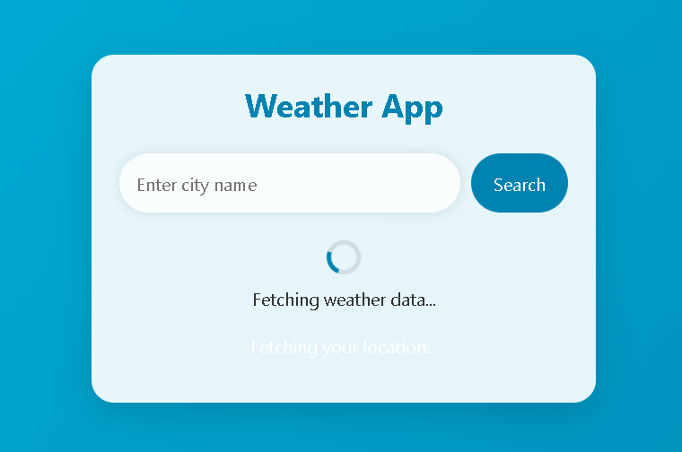
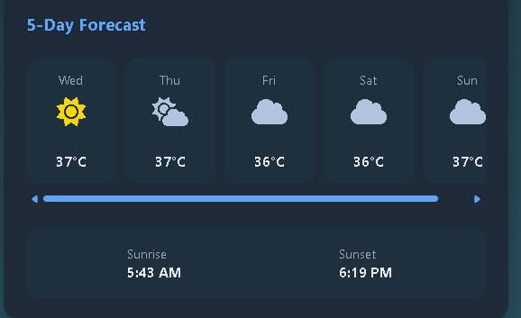

# 🌦️ Weather App

[](https://github.com/eswarsamanthula/Weather-App/stargazers)
[](https://github.com/eswarsamanthula/Weather-App/network/members)
[](https://github.com/eswarsamanthula/Weather-App/issues)
[](https://github.com/eswarsamanthula/Weather-App/blob/main/LICENSE)

A responsive Weather App built with **HTML**, **CSS**, and **JavaScript** that shows the current weather and forecast for any city using the **OpenWeatherMap API**.

🔗 **Live Demo:** [eswarsamanthula.github.io/Weather-App](https://eswarsamanthula.github.io/Weather-App)

---

## ✨ Features

- 🌍 Search weather by city name
- 🌡️ Displays temperature, humidity, wind speed, and weather condition
- 🕐 Real-time local time based on location
- 📅 5-day weather forecast *(if added)*
- 📱 Mobile-friendly and responsive design

---

## 📸 Screenshots

### 📌 Current Weather



### 📅 5-Day Forecast



> 📁 Place your actual screenshots inside a `screenshots/` folder.

---

## 📅 Roadmap

- [x] Fetch and display current weather
- [x] Responsive layout
- [ ] 5-day forecast section 📆
- [x] Weather icons based on conditions ⛅
- [x] Error handling (e.g. city not found)
- [x] Loading spinner while fetching
- [ ] `.env` support for secure API key (only in local dev)

---

## 🛠️ Tech Stack

- HTML5
- CSS3
- JavaScript (ES6+)
- [OpenWeatherMap API](https://openweathermap.org/api)
- GitHub Pages for deployment

---

## ⚙️ How to Use

### 🧪 Local Setup

```bash
git clone https://github.com/eswarsamanthula/Weather-App.git
cd Weather-App
```
## 🙌 Contributing
Found a bug or want to suggest a feature? Open an issue or submit a pull request!

## 📬 Contact
Created by Eswar Samanthula
📧 Email: eswarsamanthulas@gmail.com

